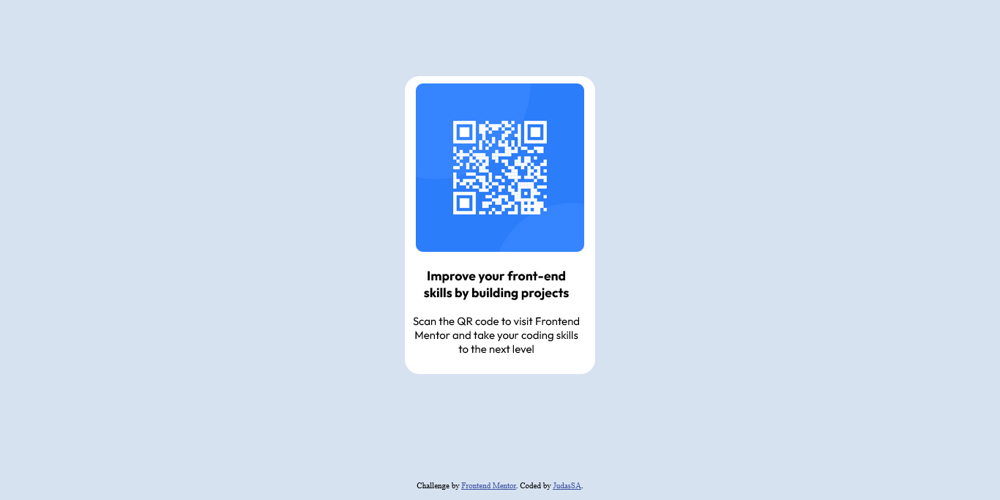

# Frontend Mentor - QR code component solution

This is a solution to the [QR code component challenge on Frontend Mentor](https://www.frontendmentor.io/challenges/qr-code-component-iux_sIO_H). Frontend Mentor challenges help you improve your coding skills by building realistic projects. 

## Table of contents

- [Overview](#overview)
  - [Screenshot](#screenshot)
  - [Links](#links)
- [My process](#my-process)
  - [Built with](#built-with)
  - [What I learned](#what-i-learned)
  - [Continued development](#continued-development)
  - [Useful resources](#useful-resources)
- [Author](#author)
- [Acknowledgments](#acknowledgments)

**Note: Delete this note and update the table of contents based on what sections you keep.**

## Overview

### Screenshot



### Links

- Solution URL: [Add solution URL here](https://your-solution-url.com)
- Live Site URL: [Add live site URL here](https://your-live-site-url.com)

## My process

### Built with

- Semantic HTML5 markup
- CSS custom properties
- Flexbox
- Mobile-first workflow

### What I learned

I learned how to center a component right in the middle of the page using flexbox.

This is shown in the code below:

```html
<div class="container">
  <div>
    Some box
  </div>
</div>
```
```css
.container {
    display: flex;
    justify-content: center;
    align-items: center;
    height: 95vh;
}
```
### Continued development

At this point I am still a complete beginner. My plan is to learn more about building layouts using technologies like flexbox and css grid.

### Useful resources
- [Web.dev](https://www.web.dev) - This is my goto website to learn everything html and css

## Author

- Website - [LOADING...]
- Frontend Mentor - [@JudasSA](https://www.frontendmentor.io/profile/JudasSA)

## Acknowledgments
Thanks to web.dev and FrontendMentor for the Freebies LOL.
